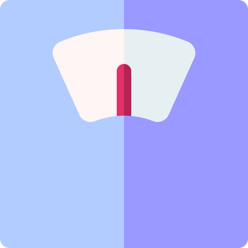
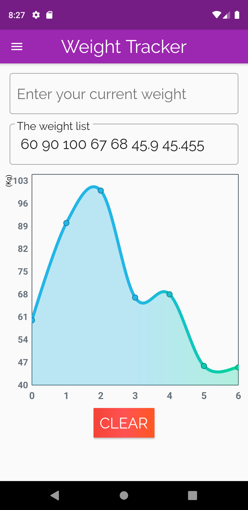
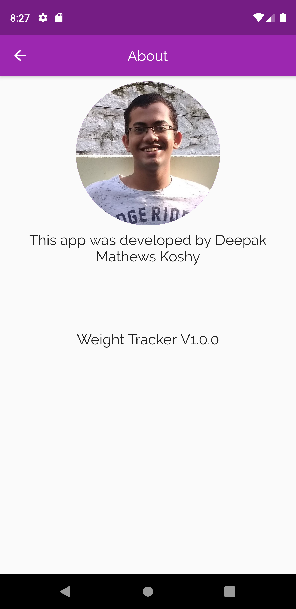

# Weight Tracker - V0.1.0

This is just a small Weight tracking application developed using Flutter. 

0.1.0: This is just a very basic app and not a production ready app. But you can check out the chart and the Hive DB in action.

## Screenschots:

  
  
  

## Packages Used:
* <a href="https://pub.dev/packages/fl_chart">FL Chart</a> for representing the weight data graphically
* <a href="https://pub.dev/packages/hive">Hive</a> NoSQL Database for storing the weight locally
* <a href="https://pub.dev/packages/path_provider">Path Provider</a> for finding the db path location
* <a href="https://pub.dev/packages/flutter_launcher_icons">Flutter Launcher Icons</a> for adding the app icon

Check out Log.md if you have time to kill and to see what was going on my head(log updates)
