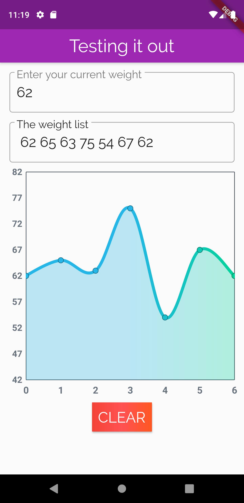
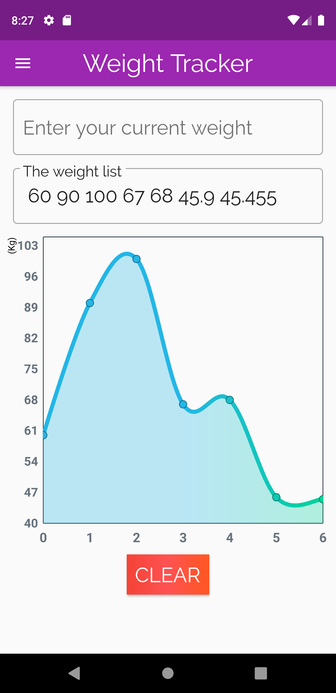
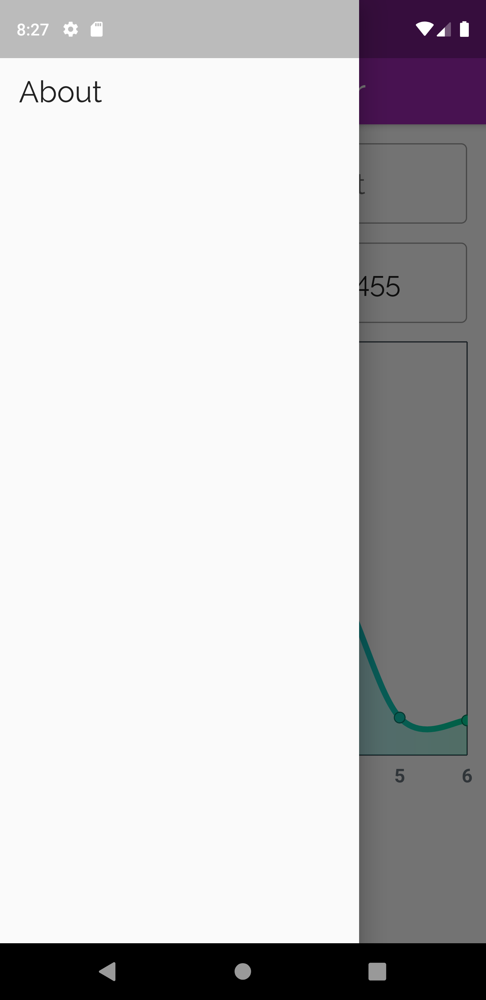
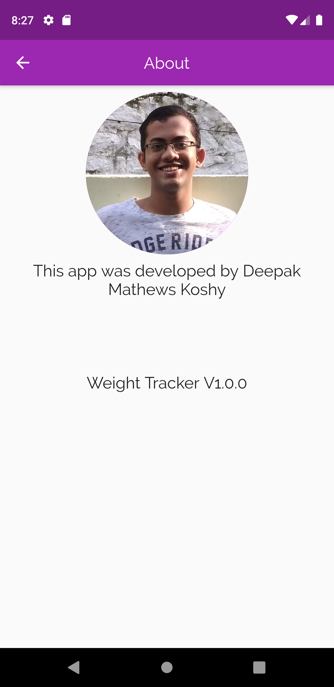

# Log
This is for Deepak's eyes only, not much of a problem if anyone else sees, but just that its going to be written in a coloqial manner.

### 30-07-2020:
This is going to be the first log update. I started this project on July 26th, 2020. I had just completed the converter app 2 days ago. That app was purely based on the Udacity Flutter course, and other than adding the swap functionality everything else was from the Udacity made code. But it was a great learning experience, and I am sure if I had just tried to build an app from scratch, then I would have run into some big problems because of inadequate knowledge in flutter and dart.

After building the final APK for that project, I started researching about some project ideas in flutter, and I came across a Medium article linking to several open source flutter apps, and one of them was a weight tracker app. The app looked really simple, and since I love tracking my weight, I gave it a shot.

This app was made from scratch by myself. The first 2 or 3 days I was just tinkering behind taking inputs from the user and storing it to a list. Managing the list took some time, but it was really worth the time.

Then I thought about adding a chart which will give a quick glance over the past few days. I started out with some google's chart package, but soon I came across fl_chart package. The moment I saw that package website, I knew it was the One. The chart UI was so aesthetically pleasing, just the way I thought in my mind.

So that brings to 29th of July. I looked at the documentation of the fl_chart package and soon the enthusiasm started to reduce. There were so many parameters and properties, and I had no idea on how to use them. Then what I did was just copied one sample graph code and started to edit the parameters. **That worked!**

Soon I was immersed in the various properties and understood many of them were not of any use. After I got a sense of how the graph works, my next task was to use the list made by the user to generate the X and Y co-ordinates in the graph. This took a shit ton of time. But it was really fun debugging the code, putting up lines and lines of temporary code to check every single methods and lists and what not. Finally had the Eureka moment by 30th July( early morning). Got everything figured out and the app was doing exactly what I wanted it to do(For now). Thats the end of log #1, should create a To-Do section on what all to implement next.

Screenshot:

  

### 31-07-2020:
When a user adds a weight for the first time, the Y axis weight range is updated according to that first weight. The graph will be repainted using the new range on Y axis based on the user's first input.

Built a release APK and tried out on my phone. The graph needs some touch properties, everything else seems good.

Created a new project in firebase and connected it to the app

### 06-08-2020
Added firebase and made it work. The data is saved in firestore and was able to retrieve it succesfully. An issue occured with FIeldValue.arrayUnion where no 2 identical values can be added simultaneously. So had to add the data to the array and pass the array to the firestore.
Made quite a lot of minor changes like: 
* Repurposed the "What you just typed' section to show the list of weights. 
* Removed the container which showed the list 
* Added a clear button to clear the list and update that also in firestore
* If user inputs a decimal value as the first weight, the Y-axis titles will still be integer.

Screenshot:

  

There is one major bug right now: When the app is launched for the first time, even if there is data in firebase, it is not reflected in the app. Only when the user inputs a value will the data be fetched and will be updated in the app accordingly. 

Anyway **Firebase is going to be removed from the project** because for this app requirement, using Firestore as database is a wastage of resources. A simpler way will be to use a database stored in the local storage of the user. Hence the next update would be to remove firestore and use Hive as a replacement. Not sure if I will be continuing with Hive, but that's the choice for now. Hence the major bug I just mentioned won't be considered, hoping implementing Hive will also sort out that issue(But should understand in the future why that bug)

### 08-08-2020
Completely replaced firestore with Hive. I love Hive so much, the simplicity in writing and understanding the code makes it so lovable. As expected the major bug notified in the last log update has been fixed. The data is there when the app is launched. 

Right now there is a very tiny delay(about 100-200ms) in loading the main screen while it waits for loading the DB( opening box in Hive). That wait is shown as a splash screen( Scaffold with Loading text and circular progress indicator). Not much of an issue, but should improve the splash screen to be more likable. Again giving this very light weightage as the current splash screen also doesn't look that bad.

Now that the base app is ready, its time to move on to modifying the graph(detailed in ToDo). Overall I am satisfied in how the app is turning out.

### 09-08-2020
Spent most of the day in figuring out how to modify the graph to show the weight without touching the graph, its possible, but I couldn't figure it out. Don't want to spend any more time on that.

Added Kg to the Y axis(it looks wierd).

Made the graph responsive to user inputs. The graph's X axis is changed according to the user input(Changing the default 7 in X-axis). Also the app will update the Y-axis as and when required. Need to modify the Y-axis interval so that things don't get cluttered when the weight range is high.

### 10-08-2020
The Y-axis will update when the weight range is high(updates the interval to 7 when the range is higher than or equal to 60). 

The user input is checked for errors while inputting.

### 11-08-2020
Added a drawer(Side menu bar) and created an about page which has my photo(in circular avatar) and 2 lines of text. The sidebar has just 1 tile(about). Need to study about using tab bar too.

### 15-08-2020
This is just a plain update, no changes. I am not sure where I want to go with this app. I am going to leave it right here and come back when I get interested.

Screenshot:

  
  
  

### 20-08-2020
Going Public! Making this repo public as I have literally nothing good to show on my git profile. 

Added a new logo for the app, built a new apk with the logo. Created new Readme page and moved this log to another new file log.md

### 24-08-2020
Implemented TextEditingController to control user input text field. Added a button where the user can press after typing the weight(Makes it more user-friendly).
Changed the app name to Weight Tracker( replacing Weight_Tracker). Some minor changes like changing header font size, correcting version number in about page.

Special mention to Kevin Jacob for reporting the above bugs

# ToDo
* Converting the X-axis title to dates like 30/07, but lots of things to note like what if user updates the weight more than once in a day etc. 
* Two tabs for past week graph range and past month graph
* Change the touch property for graph.
* The graph must show the weight without even touching the graph.

# Done
* When a user adds a weight for the first time, the Y axis weight range should be according to that first weight.
* Connected FireBase to the app.
* Removing the what user inputted widget or just repurpose it to show the list of weight.
* Learn how to implement the database in Firebase instead of storing it locally.
* Implemented Hive as a replacement for firestore
* Named Y axis: **Kg** 
* The user input must be checked and error must be shown if unacceptable input is entered.
